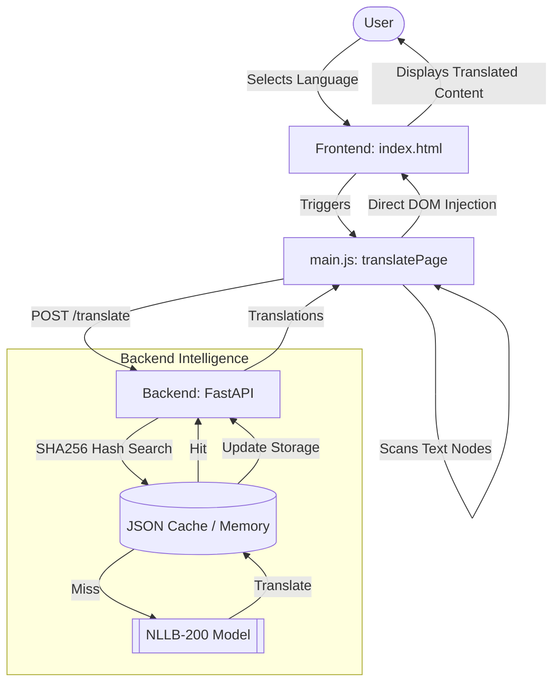

# 🌐 AI-Powered Site Translator

[](https://fastapi.tiangolo.com/)
[](https://huggingface.co/docs/transformers/index)
[](https://developer.mozilla.org/en-US/docs/Web/JavaScript)

A high-performance, AI-driven translation system designed for real-time website localization. Utilizing the **NLLB (No Language Left Behind)** model and a sophisticated multi-layer caching mechanism, it provides near-instant translations into **Bengali** and **Hindi**.

## 🎥 Demo Video

https://github.com/DEEPSEN1998/Ai-translate-system/blob/main/ai-translate.mp4


---

## 🚀 Key Features

- **⚡ Instant Caching**: Sub-3ms response time for cached content using an in-memory SHA256 hashing system.
- **🤖 State-of-the-Art AI**: Powered by Meta's NLLB-200 model for high-accuracy results.
- **📦 Batch Processing**: Translates entire pages in a single optimized API request.
- **🌓 Multi-Layer Persistence**: Site-specific JSON caching reduces redundant model inference and minimizes disk I/O.
- **🔌 Zero-Config Frontend**: A lightweight, drop-in Vanilla JS script that scans and updates the DOM automatically.

---

## 🛠️ Architecture & Flow

The system architecture is split into a robust Python backend and a reactive JS frontend.



---

## 📂 Project Structure

```bash
ai-translate-website/
├── backend/            # FastAPI Server
│   ├── main.py        # Core Logic & Model Integration
│   ├── models/        # NLLB Model Weights (Gitignored)
│   └── data/          # Site-specific Translation Caches
├── frontend/           # Client-side
│   ├── index.html     # Demo / Main Page
│   └── main.js        # Translation Switcher & DOM Logic
└── requirements.txt    # Python Dependencies
```

---

## ⚙️ Installation

### 1. Backend Setup
```powershell
# Create & Activate Virtual Environment
python -m venv venv
.\venv\Scripts\activate

# Install Dependencies
pip install -r requirements.txt

# Download / Place NLLB Model
# Place 'nllb-200-distilled-600M' in backend/models/
```

### 2. Run the Server
```powershell
cd backend
uvicorn main:app --reload
```

---

## 🖱️ Usage

1.  Open `frontend/index.html` in your browser.
2.  Use the **floating language switcher** at the top-right.
3.  The system will automatically collect text, translate via AI, and update the view.

---

## 🔧 Performance Optimization

- **GPU Acceleration**: Automatically detects and uses CUDA if available.
- **Memory Management**: Models are loaded/unloaded dynamically to optimize RAM usage.
- **Lazy Caching**: Translations for all supported languages are generated once and stored, preventing future "Misses".

---

<div align="center">
  <sub>Built with ❤️ by Deep Sen </sub>
</div>
